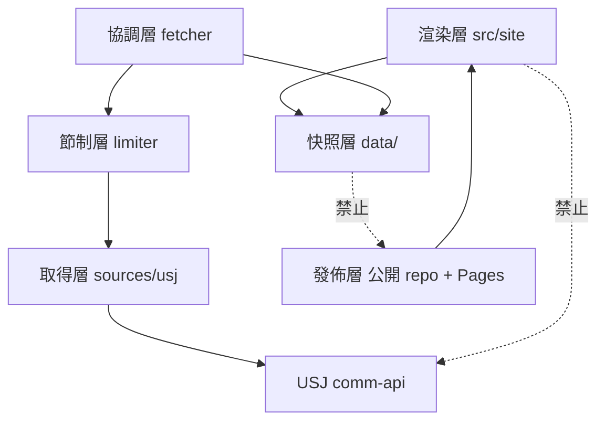
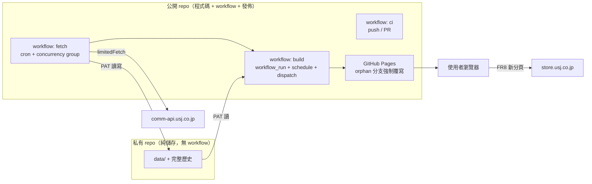
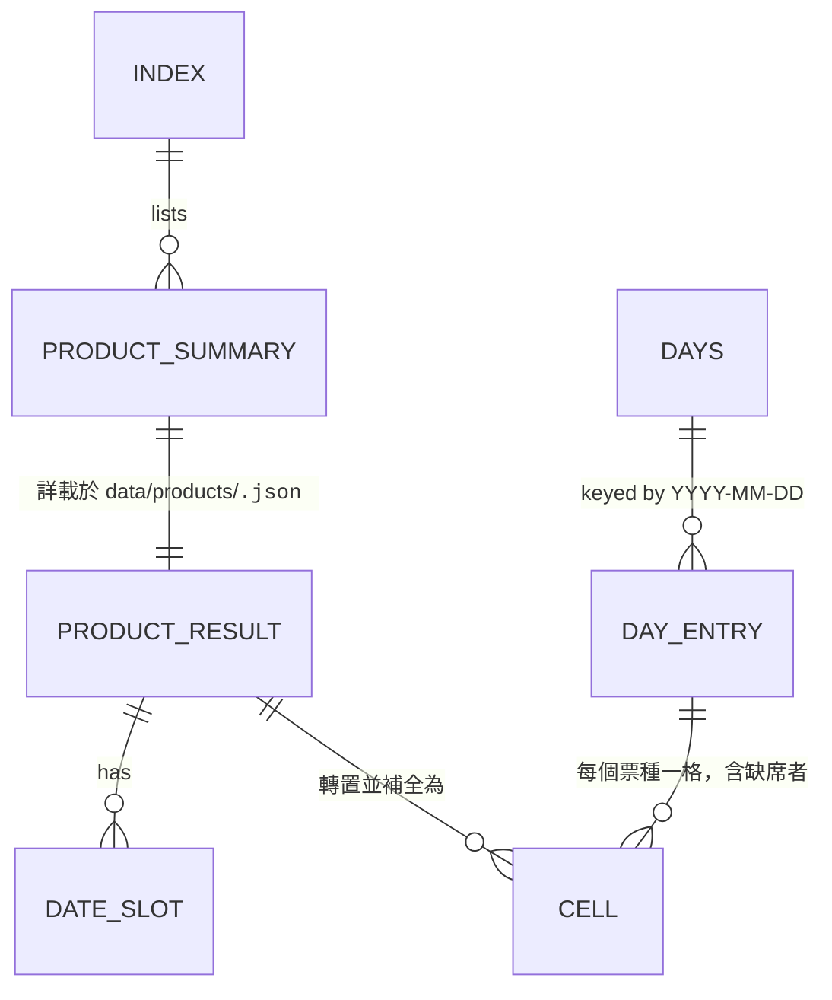

# Architecture Spine — USJ 通行證庫存看板

> **現況基準（2026-08-21 直接驗證）**：`wisely051543/self-usj` 為**公開** repo，`has_pages: true`，站台自 2026-08-15 起已上線，`data/days.json` 於 `raw.githubusercontent.com` 公開回 200，255 個 commit 的抓取歷史已散佈。本脊椎的所有規則以此為起點，不假裝是綠地。

## Design Paradigm

**分層批次管線 → 不可變快照 → 建置時靜態渲染。**

六個層，每層只依賴它下游的那一層：

| 層 | 職責 | 落點 |
| --- | --- | --- |
| 取得層 | 一個票務平台的目錄與可購性，實作 `Source` port | `src/sources/` |
| 節制層 | 所有外送至來源的請求的**唯一**閘門：速率、並行、退避、回合預算 | `src/limiter.ts` |
| 協調層 | 三層排程、差異寫檔、跨票種轉置、**格網補全與狀態判定** | `src/fetcher.ts` |
| 快照層 | 版本化、不可變的事實 | 私有儲存 repo 的 `data/` |
| 渲染層 | 以 `(locale, 視角, 鍵)` 為參數產出靜態頁 | `src/site/` |
| 發佈層 | 建置產物 → 公開 repo → GitHub Pages | 公開 repo + Actions |

來源層是 ports-and-adapters：`src/types.ts` 的 `Source` 介面是 port，`src/sources/usj.ts` 是 adapter。此形狀既有程式碼已具備，本脊椎批准而非重新發明。

## Invariants & Rules



實線為允許的依賴，虛線為明文禁止的兩條路徑：渲染層永不接觸來源（AD-7），快照層永不進入公開發佈面（AD-5）。

### AD-1 — 系統唯讀 [ADOPTED]

- **Binds:** all
- **Prevents:** 本產品滑入被實際執法過的那一類商業模式（收費 + 高頻搶佔稀缺資源 + 代客完成訂位）
- **Rule:** 不得建立購物車、不得保留庫存、不得自動化任何下單或預約流程、不得涉入票券轉售、不得對使用者收費以解鎖庫存資訊。違反此條的功能提案須在架構層被推翻，不得由實作階段自行判斷。

### AD-2 — 資料只從無候位閘門的端點取得 [ADOPTED]

- **Binds:** 取得層
- **Prevents:** 規避存取控制的定性
- **Rule:** 不得繞過、預熱或自動化通過 `nbcuniversal.queue-it.net` 以讀取結帳階段庫存。新增任何來源端點前，須先確認該端點未被轉向至候位機制，並將確認結果記入 memlog。

### AD-3 — 單一外送閘門

- **Binds:** 取得層, 節制層, 協調層
- **Prevents:** 第二條繞過速率控制的請求路徑出現，使所有節制承諾同時失效
- **Rule:** 所有發往來源主機的 HTTP 請求必須且只能經由 `src/limiter.ts` 的 `limitedFetch`。任何層皆不得直接呼叫 `fetch`。此規則由 lint 或測試強制（禁止 `src/` 內出現 `limiter.ts` 以外的裸 `fetch(`）。註：`limitedFetch` 的回合預算是**單一 process 內的模組狀態**；建置為另一個 process，但建置依 AD-7 對來源零請求，故不共用預算不構成漏洞。

### AD-4 — 速率上限由測試強制；其餘四值為互鎖組，改動須整組重算

- **Binds:** `src/limiter.ts`, `.github/workflows/fetch.yml`, `index.html`／其繼任者的 `STALE_MS`
- **Prevents:** 一次「順手優化」讓整套法遵判斷無聲失效——註解已被證明擋不住（`limiter.ts` 的警告註解此刻就在，值仍是 5）
- **Rule:** 三個常數須自 `src/limiter.ts` 具名匯出，並由測試斷言 `RATE_LIMIT_PER_SEC <= 1` 與 `MAX_REQUESTS_PER_RUN <= 6000`，斷言失敗即 CI 失敗。
  **`CONCURRENCY` 不設靜態上限斷言**：PRD §7.2 實測顯示並行度由 4 降至 2 會把冷啟動由約 12 分推到約 21 分，越過 NFR5「不超過排程間隔一半」（cron `*/30` ⇒ 15 分）的天花板，並逼近 `timeout-minutes: 25`。因此 `CONCURRENCY`、cron 間隔、`timeout-minutes`、`STALE_MS` 四者構成**互鎖組**：任一項變更時，變更的 PR 必須同時附上四者的重算，且測試須斷言 `冷啟動預估耗時 < cron 間隔 / 2`，預估公式與其輸入（平均延遲）以常數形式與被斷言值放在一起。
  **當前一致解**（PRD §7.2 已驗算）：`RATE_LIMIT_PER_SEC = 1`、`CONCURRENCY = 4`、cron `*/30`、`timeout-minutes: 25`、`STALE_MS = 90 分`。降並行度不是 P0 的一部分。

### AD-5 — 抓取快照不得進入公開發佈面（向前生效）

- **Binds:** all
- **Prevents:** 持續擴大 NFR9.1 第 1 項（停抓後銷毀抓取資料及其衍生物）在技術上不可執行的範圍
- **Rule:** `data/` 及其後續歷史只存在於一個**私有、無 workflow 的儲存 repo**。公開 repo 承載程式碼、workflow 與建置產物；Actions 在公開 repo 執行（標準 runner 免費不計量），以 fine-grained PAT 讀寫私有 repo。
  **此規則向前生效，不是狀態承諾。** 2026-08-15 起已公開散佈的 255 個 commit 之抓取歷史不可收回（fork、GHArchive、既有 clone），任何「已清除」的敘述皆為不實。遷移時須明確決定公開 repo 內既有 `data/` 的處置（保留或以歷史改寫移除），並記錄該處置不改變已散佈的事實。

### AD-6 — 站台的可部署性不依賴抓取的成功

- **Binds:** 協調層, 渲染層, 發佈層, NFR11, R14
- **Prevents:** 抓取全滅時站台一併失去可部署性——R14（資料源單方消失）或 kill switch 啟動時，站台仍必須能被重新建置、重新部署、修改站上文案與聲明
- **Rule:** 抓取與建置為兩條獨立 workflow，皆位於公開 repo。串接方式為 `workflow_run`（`GITHUB_TOKEN` 推的 commit 不觸發 `push` workflow，故不得用 `on: push`），並須注意兩項語意：`workflow_run` 只讀**預設分支**上的 workflow 檔，且在被觸發的 workflow **完成時**觸發而非成功時——建置 workflow 必須自行檢查 `conclusion`。
  建置 workflow 另須具備 `schedule` 與 `workflow_dispatch` 兩個獨立入口，使其在抓取 workflow 被停用或失敗時仍會自行執行（這是 AD-15 的 L2 得以生效的前提）。建置在無新資料時必須成功完成並輸出站台。

### AD-7 — 呈現端零來源請求

- **Binds:** 渲染層, 發佈層, NFR3.1, NFR4
- **Prevents:** 開出一條與使用者流量成正比、且完全不受 `src/limiter.ts` 管轄的對外請求通道——AD-4 的速率上限對它完全無效
- **Rule:** 已發佈的頁面不得對 `usj.co.jp` 的任何主機發出請求，包含但不限於圖片熱連結。票種呈現改以自製圖示或純文字。
  **本規則的範圍僅為 `usj.co.jp`。** 第三方廣告主機（FR25）與同意管理平台（NFR15.4）的執行期請求不在禁止之列，由 AD-8a 另行約束。

### AD-8 — 站台的資料零 runtime fetch

- **Binds:** 渲染層, FR16, NFR19
- **Prevents:** 核心內容退回成需要 JS 才讀得到
- **Rule:** 頁面所需的全部**資料事實**於建置時 bake 進 HTML。頁面不得在執行期 fetch 任何資料檔，亦不得由 JSON-LD 或任何腳本改由 `products/*.json` 取得同一事實（否則同一頁會出現兩個來源的 `units`，且六個 URL 足以讓第三方重建 `days.json`，反噬 AD-9）。**單一頁面上的每一項事實只能有一個來源：該頁 bake 進來的那一份。**

### AD-8a — 第三方腳本的邊界

- **Binds:** FR25, NFR15.4, NFR17, NFR18, AD-8
- **Prevents:** 廣告與同意管理腳本以「反正 AD-8 只管資料」為由無限擴張，侵蝕 NFR18 的版面位移與 Core Web Vitals 承諾
- **Rule:** 允許的第三方執行期腳本僅限廣告投放（FR25）與同意管理平台（NFR15.4）。它們不得承載任何核心內容，不得為頁面可讀性的前提（關閉 JS 時頁面仍完整），且廣告版位須預留固定尺寸以免造成版面位移。新增任何其他第三方腳本前，須先確認它落入 NFR15.3 的外部送信揭露範圍並更新該頁。

### AD-9 — 公開面不發佈可批次消費的資料

- **Binds:** 發佈層, R13
- **Prevents:** 把 `days.json` 掛成任何人可 `curl` 的免費 API——那同時餵養兩家收費競品，並最大化 R13 民法 709 条「行為態樣」評價中最不利的那一面
- **Rule:** 公開 repo 與已發佈站台只包含渲染後的 HTML、`robots.txt`、`sitemap.xml` 與 FR21 要求的逐頁 JSON-LD。不得包含任何資料檔。
  發佈方式須為**單一 orphan 分支的強制覆寫**，理由有二：(a) 逐次累積的部署 commit 本身就是一份比 `data/` 更好用的公開時間序列（每 30 分一筆的渲染剩餘量），會從側面推翻 AD-5；(b) 覆寫使已發佈樹恆等於 `dist/`，AD-19 的驗證才涵蓋實際服務的全部內容，不會有前次遺留的孤兒 URL 落在 sitemap 與 hreflang 之外。

### AD-10 — 頁面產生器參數化

- **Binds:** 渲染層, O11
- **Prevents:** O11（可索引 URL 數對應約 1,449 種長尾意圖）三個月後回來要求擴大 URL 覆蓋時，架構已把便宜的路堵死——而 O11 的解除條件本身就要求「先上線才拿得到數據」
- **Rule:** 渲染核心以 `(locale, 視角, 鍵)` 為參數產出頁面。不得為個別頁面寫死渲染路徑。新增一種頁面粒度（每票種、每月）必須是多餵一組參數，不得改動渲染核心。

### AD-11 — 兩個閱讀主軸各自擁有獨立 URL

- **Binds:** FR2, FR6, FR13, FR16, NFR19
- **Prevents:** 第二軸淪為只存在於 JS 環境的狀態——對爬蟲不存在、不可分享、不可索引
- **Rule:** 「依日期」與「依票種」兩個視角於建置時各自產出獨立、可索引的 URL；切換即導航。JS 只在可用時把導航升級為無重載切換，不得成為切換的前提。核心比較操作在小螢幕上不得依賴橫向捲動（FR6）。
  **可索引頁集合**＝`3 語 × 2 視角` ＋ 每語一份的揭露頁組（隱私權政策 NFR15.2、外部送信情報 NFR15.3、關於本站與聯絡方式 NFR9.2／NFR13～NFR15）。確切頁數由該頁組如何切分決定，屬渲染層的實作判斷；**唯一的不變量是 AD-19 的驗證以產生器實際輸出的頁集合為準，不得以任何寫死的數字為準**。

### AD-12 — 每個格子的狀態由協調層明確判定，渲染層不得從缺席推論

- **Binds:** FR3.1, O1, 協調層, 快照層
- **Prevents:** 缺席的成因（售罄／尚未開賣／不營業／未知）散落在多個消費者各自重推而互相分歧；以及一個根本更嚴重的失敗——渲染層拿到的資料裡**根本沒有那個格子**，於是只能猜
- **Rule:** 快照必須攜帶**完整的 (日期 × 票種) 格網**：值域內的每一個組合都有一筆明確狀態，而非只有可購的那些。狀態由 `src/fetcher.ts` 判定一次，渲染層與任何下游消費者一律讀取，不得自行重推。（技術依據：「該日是否所有票種皆無」需要跨票種視野，而協調層是唯一同時看得到所有票種的地方。）
  **協調層不得丟棄 `available: false` 的日期列。** 來源回傳了該日期但標為不可購，是區分「售罄」與「未知」的**唯一直接證據**；現行 `buildDays()` 將其丟棄，必須改正。
  格網的編碼形式由程式碼自行決定（完整展開或以預設值加例外表），不在本脊椎固定。

### AD-13 — 不確定時顯式標為未知，絕不猜測

- **Binds:** FR3.1, NFR11, NFR12, NFR15.1
- **Prevents:** 把「尚未開賣」誤報為「售罄」，側錄使用者做出「看到售罄就放棄計畫」的錯誤決定——與 NFR15.1「一切以 USJ 官方頁面為準」直接牴觸
- **Rule:** 判定所依據的證據不足時，該格一律為顯式的「未知／無資料」並連向官方頁。任何情況下都不得把無資料一律呈現為售罄，呈現亦不得暗示售完為永久狀態（NFR12）。
  **具名的已知證據缺口**：`latestDate` 在實測中有 10/31 個產品為空字串。空的 `latestDate` **必須**判為未知，不得回退為售罄或不營業——這一個條件就影響約 620 個格子的整體翻面。O1 的實測須明確涵蓋此情形。

### AD-14 — 快照的 schema 版本嚴格且各檔獨立

- **Binds:** 快照層, 渲染層
- **Prevents:** 協調層與渲染層對同一份檔案的理解無聲分歧，渲染出看似正常但語意錯誤的頁面
- **Rule:** `data/` 下的每一份檔案各自擁有獨立的 `schemaVersion` 序列，結構變更必須升版。渲染層遇到不認識的版本必須中止建置並報錯，不得降級渲染。（`index.json` 目前為 5，`days.json` 目前為 1；AD-12 的格網化使 `days.json` 升至 2 —— 兩者的版號互不相干，不得因數字相同而共用判斷。）

### AD-15 — kill switch 為分級狀態，每級單一動作，不依賴第三方後台

- **Binds:** NFR9, NFR9.1, NFR9.2, NFR19, R15
- **Prevents:** 抓取已停而站台不知情，繼續以正常樣式顯示逐漸腐朽的資料；以及 R15 的假處分情境下（大阪、日語、目的為關站、速度快）最深的一級需要登入某個第三方後台才做得到
- **Rule:** kill switch 是一個**帶等級值的宣告檔**（不是「存在／不存在」的旗標——單一存在性無法表達三級，且會使 L1 不可達）。等級：
  - **L1 停抓**：抓取 workflow 立即結束；站台續存，顯著標示資料已凍結及其時間。
  - **L2 停止服務**：L1 加上站台明示已停止更新服務。
  - **L3 下架**：站台自公開發佈面移除。
  抓取 workflow 讀該檔決定是否執行，**建置 workflow 讀同一份檔決定渲染哪一級的呈現**。因此建置必須具備獨立於抓取的觸發入口（AD-6），否則停用抓取會讓 `workflow_run` 永不觸發、站台永遠進不了 L2——那正是本條要防的事。
  L3 必須是自公開 repo 可單一動作達成的（移除發佈分支或關閉 Pages），且該動作須與 NFR9.1 的其餘兩項（既有歷史處置、對外窗口）一併寫成書面程序。頁面須常設可運作的聯絡信箱（NFR9.2）。
  GitHub UI 停用 workflow 僅作為抓取端的第二道閘，**不得作為 L2 或 L3 的手段**。

### AD-16 — 失敗邊界明確定義，且必須偵測「什麼都沒抓到」

- **Binds:** NFR8, NFR10, NFR11, NFR19, R14, 發佈層
- **Prevents:** 這個專案真正的危險不是吵而是靜。最惡劣的具體場景：來源改了 schema（R14），`calendarDates` 回空陣列，於是 `failed: 0`、`days.json` 全空、`updatedAt` 嶄新、`exit 0`、綠色建置、綠色驗證——然後發佈一個三語的「未來六個月全部售罄」站台，零告警
- **Rule:** 下列情況必須讓 job 失敗（依賴 GitHub 內建失敗通知，不新增外部通知管道）：
  1. 被來源封鎖（403 或連續 429）
  2. `budgetExhausted` 觸發
  3. 連續 N 回合抓取失敗
  4. 資料齡超過門檻
  5. 推送私有儲存 repo 或公開發佈分支的 PAT 失效
  6. **合理性檢查未過**：本回合的產品數、可購格子數或日期涵蓋範圍相對於前一份快照發生超出容差的崩塌。零結果與近零結果一律視為失敗，**不得**寫入快照。
  單一產品失敗仍不紅（既有設計，保留）。渲染層在任何失敗情況下皆沿用上一份成功快照並標示其實際擷取時間（NFR11）。

### AD-17 — 本站身分不得以官方標識承載 [ADOPTED]

- **Binds:** 發佈層, FR11, FR15, NFR3.2
- **Prevents:** 在一個掛廣告的營利站台上以他人著名標識識別本站——商標法 26 条 1 項 6 号與指示性使用是個案抗辯，不是安全港
- **Rule:** 站名、網域與品牌識別不得使用「USJ」「Universal Studios Japan」「ユニバーサル」等標識作為主要識別，不得使用官方 logo 與識別色。以官方名稱**指稱商品**（FR11）是允許的；以官方名稱**識別本站**不是。

### AD-18 — 兩個字串預算的規則不同，不得共用一條檢查

- **Binds:** FR10, FR11, FR12, 渲染層, `.claude/skills/localizing/SKILL.md`
- **Prevents:** 把兩種語意相反的表當成同一種東西處理——`localizing` skill 明文記載：頁面文案表是**全有全無**的（缺一個 key 就 render `undefined`），而廠商詞表的**部分覆蓋是刻意的**（"Never invent an entry to avoid a gap"）。對詞表施加「缺 key 即失敗」會直接逼出 FR11 禁止的自行翻譯
- **Rule:**
  - **頁面文案**（本站自己的措辭）存於 `i18n/ui.<locale>.json`，與 `terms` 表分開。**必須完整**：任一 locale 缺任一 key 即 CI 失敗。
  - **廠商字串**（USJ 的措辭：票種名、`eyebrow`、`legalDesc`）維持既有 `i18n/terms.<locale>.json`。**允許不完整**；缺項的正確行為是回退呈現日文原文，不是失敗，更不是自行翻譯。CI 只檢查結構有效與回退可用。
  - 每個廠商字串的**來源狀態**（canonical＝已在 usj.co.jp 該語言頁面確認／provisional＝尚未確認）必須被記錄且可稽核，沿用 `terms` 檔既有的 `verified` 欄位。這是 FR11「採用官方正式名稱、不得自行翻譯」的實際控制點。
  - 遊樂設施名稱的擁有者依語言而異：來源 API 接受的語言（`NAME_LANGS`）由資料攜帶，不接受的語言由詞表承擔。因此「新增語言＝新增兩個 JSON 檔」**只在來源 API 拒絕該語言時成立**；接受時尚須把語言碼加入 `NAME_LANGS`。新增語言的完整程序以 `localizing` skill 為準。
  - **本 AD 一旦實作，`.claude/skills/localizing/SKILL.md` 必須同步更新**——它現在寫著頁面文案住在 `index.html` 的 `STRINGS`。脊椎改了而 skill 沒改，下一個做在地化的人或 agent 會照著錯的地圖走。

### AD-19 — SEO 與揭露的正確性由驗證腳本強制，以實際輸出為準

- **Binds:** FR13, FR14, FR15, FR17, FR24, NFR15.2, NFR15.3
- **Prevents:** hreflang／canonical／sitemap 的手寫錯誤——這類錯誤是**靜默失敗**，不報錯、只是沒有流量，而流量正是本產品的商業模式
- **Rule:** 建置後須執行驗證腳本並在失敗時中止發佈。檢查對象為**產生器實際輸出的頁集合**（不是任何寫死的清單或數字），至少涵蓋：每頁具 canonical；同一視角的三語 hreflang 三向互指且對稱（**hreflang 只在同視角的語言之間宣告，視角之間不互指**）；`sitemap.xml` 恰好涵蓋輸出中所有可索引頁、無遺漏亦無不存在的項；`<html lang>` 與該頁內容語言一致；每語的揭露頁組（NFR13～NFR15.1）、隱私權政策（NFR15.2）與外部送信情報頁（NFR15.3）皆存在且被連結到。

### AD-20 — 來源層為 ports-and-adapters [ADOPTED]

- **Binds:** 取得層
- **Prevents:** 新增票務平台時把平台細節滲進協調層
- **Rule:** 每個票務平台實作 `src/types.ts` 的 `Source` 介面。「哪些產品值得昂貴的時段取得」是協調層的判斷，不是來源的；「該通行證有沒有時段」是來源自己的判斷，經 `ProductResult.deep` 回報。

### AD-21 — 沒有消費者的抓取層必須關閉

- **Binds:** NFR4, NFR5, NFR6, R3.2, 協調層
- **Prevents:** 對來源產生無人使用的負載——而「不当な負担や負荷」正是 USJ 使用条件中唯一一條本產品可以主張「已針對其明示關切採取具體措施」的條款（R3.2），在該條下製造純粹浪費的請求是自傷
- **Rule:** FR5 明文只要求時段的**數量**、不展開明細，且 AD-8 使站台不再消費 `timeSlots`。因此時段層的取得範圍必須縮減到只夠算出數量，或在確認無消費者後停止。任何抓取層在其產出無人消費時必須關閉，不得因「反正資料留著」而續抓。既有的人數篩選功能（`MAX_PEOPLE`，依 `availableUnits >= N` 篩選時段）本版不提供，見 Deferred——若日後恢復，時段層須一併恢復並重算 AD-4 的互鎖組。

### AD-22 — CI 是發佈的前提，不是可選步驟

- **Binds:** AD-3, AD-4, AD-18, AD-19, 全部測試與檢查
- **Prevents:** 上述所有「由測試強制」「由檢查強制」的規則因為根本沒有一條 workflow 執行它們而全部落空——現況此 repo 無測試、無 `test` script、亦無執行 `tsc` 或 `i18n:check` 的 workflow
- **Rule:** 須有一條 CI workflow，在每次 push 與 pull request 上執行 `tsc`、單元測試（AD-3、AD-4）、`i18n:check`（AD-18）。建置 workflow 在部署前須執行 AD-19 的驗證並於失敗時中止發佈。任何一項未通過即不得發佈。

## Consistency Conventions

| Concern | Convention |
| --- | --- |
| 命名 | 產品代碼沿用來源的 `code`。語言以 BCP 47 標籤表示（`zh-TW`、`ja`、`en`），全系統一致，包含檔名、URL 區段與 `<html lang>`。 |
| 日期與時間 | 日期一律 `YYYY-MM-DD`，且一律為 **JST 日曆日**（`src/dates.ts` 的 `todayJST`），不隨執行環境時區漂移。時間戳一律 ISO 8601 UTC，呈現時須標示時區（FR22）。星期以 `0=Sun … 6=Sat` 的數字攜帶，標籤由渲染層產生。 |
| 資料形狀 | `src/types.ts` 是快照層的唯一契約定義，協調層與渲染層共用同一組型別。`null` 表示「平台未揭露」或「本回合未取得」，語意不得與 `0` 混用；狀態未知須以顯式狀態值表示，不得以 `null` 兼任（AD-13）。 |
| 錯誤與降級 | 抓取失敗時保留上一份成功快照並標示其實際擷取時間（NFR11），不呈現空白頁、不靜默呈現陳舊數字。單一產品失敗不阻斷其餘產品寫入；合理性檢查未過則整份不寫入（AD-16）。 |
| 狀態變更 | 快照只由協調層寫入，且只在「答案改變」時寫（既有的差異比對，排除時間戳）——這是 commit 量體維持可控的原因，不得為求簡化而改為每回合全量覆寫。 |
| 設定與秘密 | 節制參數集中於 `src/limiter.ts` 並具名匯出（AD-4）。稀缺門檻（FR4，初始 10）為設定值，不得寫死於版面邏輯。PAT 為 fine-grained，分別僅授予儲存 repo 與發佈分支所需的最小權限。 |
| 併發 | 抓取 workflow 須設定 GitHub Actions `concurrency` 群組，同一時間只允許一個回合（NFR5.1）。 |
| 請求標頭 | 不得揭露本站網域或站名（NFR7）。 |
| 排程可靠度 | GitHub Actions 的 `schedule` 不保證準點，高負載時段的排程作業可能延遲或被丟棄。新鮮度呈現（FR18、NFR19）須以**實際擷取時間**為準，不得以排程間隔推算。 |

## Stack

| Name | Version |
| --- | --- |
| Node.js | 24.x — 釘選理由為其 **EOL 2028-04-30**（最長跑道）。現行 `.node-version` 為 20.17.0，而 **Node 20 已於 2026-04-30 EOL**，必須升級。註：Node 24 的 Active LTS 身分於 2026-10-20 交棒給 Node 26，屆時 24 轉入 Maintenance，EOL 日期不變。 |
| TypeScript | ^5（既有，型別檢查用） |
| @types/node | ^24（隨 Node 升級） |
| 執行方式 | Node 24 內建型別剝離直接執行 `.ts`，**移除 `ts-node`**（它在 Node 24 上已無必要，且與「零額外依賴」的取向矛盾） |
| 測試 | `node:test` + `node:assert`（Node 內建，零新依賴） |
| 站台建置 | 手寫 TypeScript 產生器，無 SSG 框架 |
| CI／排程 | GitHub Actions（公開 repo，標準 runner 免費不計量） |
| 託管 | GitHub Pages（自訂 Actions workflow 發佈，明文豁免 10 次/小時的建置軟上限） |

**不採用**：
- Astro 7.2.x、Eleventy 3.1.6 —— 六個量級的頁面攤不掉框架的依賴與升級面。
- Cloudflare Pages —— 免費方案 500 builds/月，而 Git 連動建置下每 30 分部署約 1,440 次/月。（**修正**：官方文件未區分，社群回報 Direct Upload 不計入該額度；若日後需遷離 GitHub，此路徑仍可行，但不應以「500 次上限」為由排除。此處不採用的實際理由是 GitHub Pages 已在使用且成本為零。）
- Vercel —— Hobby 方案明文限非商業用途（FR25 廣告變現即屬商業），且 cron 最小頻率為每日一次；Pro 為 $20/月。更根本地，7～21 分鐘的長時批次作業不是函式模型該承載的形狀。
- 私有 repo 執行 Actions —— 私有 repo 免費額度僅 2,000 分/月，而本專案約需 15,840 分/月，超額約 $83～160/月，超過 PRD R1 估計的廣告收入上限。

## Structural Seed

### 容器與部署



Actions 全部在公開 repo 執行（免費不計量）；私有 repo 無 workflow，只是儲存，因此不耗任何分鐘。

### 快照的核心實體



`days.json` 是 `products/*.json` 的**格網化**轉置：值域內每個 (日期 × 票種) 組合都有一格明確狀態，而非只有可購的那些（AD-12）。渲染層只讀 `days.json` 與 `index.json`（AD-8）。`DATE_SLOT.timeSlots` 的取得範圍受 AD-21 約束。

### 源碼樹

```text
（公開 repo）
  src/
    types.ts          # 快照層的唯一契約 + Source port
    limiter.ts        # 唯一外送閘門，常數具名匯出（AD-3、AD-4）
    dates.ts          # JST 日曆日與範圍運算
    fetcher.ts        # 協調層：三層排程、差異寫檔、格網化轉置、狀態判定（AD-12）
    sources/
      usj.ts          # USJ adapter（AD-20）
    site/             # 渲染層（AD-10、AD-11）— 新增
      generate.ts     #   參數化頁面產生器
      verify.ts       #   建置後 SEO 與揭露頁驗證（AD-19）
    i18n-check.ts     # 兩張表、兩套規則（AD-18）
    limits.test.ts    # 節制參數上限與互鎖斷言（AD-4）
  i18n/
    terms.<locale>.json   # 廠商字串，允許不完整，帶 verified 來源狀態
    ui.<locale>.json      # 頁面文案，必須完整（由 index.html 的 STRINGS 遷入）
  KILLSWITCH            # 帶等級值的宣告檔，抓取與建置皆讀（AD-15）
  .github/workflows/
    ci.yml              # tsc + 測試 + i18n:check（AD-22）
    fetch.yml           # cron + concurrency group
    build.yml           # workflow_run + schedule + workflow_dispatch

（私有 repo，無 workflow）
  data/                 # 快照層與完整歷史（AD-5）
```

## Capability → Architecture Map

| 需求 | Lives in | Governed by |
| --- | --- | --- |
| FR1–FR7 庫存總覽矩陣 | 渲染層 `src/site/generate.ts` | AD-8, AD-10, AD-11, AD-12, AD-13 |
| FR8–FR9 導流 | 渲染層 | AD-1, AD-7 |
| FR10–FR12 多語 | `i18n/`, 渲染層 | AD-18, AD-11, AD-19 |
| FR13–FR17 搜尋可見性 | 渲染層 + 發佈層 | AD-8, AD-10, AD-11, AD-19, AD-22 |
| FR18–FR20 資料透明度 | 渲染層 | AD-13, AD-15, AD-16, 排程可靠度慣例 |
| FR21–FR24 機器可讀性與代理立場 | 發佈層（JSON-LD、`robots.txt`） | AD-8, AD-9, AD-19 |
| FR25 廣告 | 渲染層 | AD-8a |
| NFR1–NFR3.2 資料來源與取得 | 取得層 + 發佈層 | AD-1, AD-2, AD-7, AD-9, AD-17 |
| NFR4–NFR8 抓取禮貌性 | 節制層 + 協調層 | AD-3, AD-4, AD-16, AD-21, AD-22, 併發慣例 |
| NFR9–NFR9.2 kill switch 與窗口 | 全系統 | AD-6, AD-15, AD-16 |
| NFR10–NFR12 新鮮度與降級 | 協調層 + 渲染層 | AD-13, AD-14, AD-16, 錯誤降級慣例 |
| NFR13–NFR15.1 揭露與定位 | 渲染層（每語揭露頁組） | AD-11, AD-13, AD-17, AD-19 |
| NFR15.2 隱私權政策 | 渲染層（每語一頁） | AD-11, AD-19 |
| NFR15.3 外部送信規律揭露 | 渲染層（每語一頁） | AD-8a, AD-11, AD-19 |
| NFR15.4 同意管理平台（EEA/UK） | 渲染層（執行期腳本） | AD-8a |
| NFR16–NFR19 行動與效能 | 渲染層 | AD-8, AD-8a, AD-11 |

## Deferred

- **遷移路徑本身**：現況已上線且公開。需要一份明確的切換計畫——私有儲存 repo 建立與 PAT 配置、既有 `data/` 歷史的處置（保留或改寫，兩者皆不改變已散佈的事實）、既有 Pages 設定由分支發佈切換為 Actions 發佈、`index.html` 退場。屬 P1 的第一批工作，不是架構決策。
- **人數篩選功能**（`MAX_PEOPLE`，依 `availableUnits >= N` 篩選時段）。既有站台已提供，本版 PRD 未涵蓋，AD-8／AD-21 使其失去資料基礎。**這是一項功能移除，須經 PM 確認而非由架構默默執行。** 恢復的話 AD-21 與 AD-4 的互鎖組須一併重算。重訪：P2 規劃時。
- **網域名稱與營運主體形態**（NFR3.2、R15、O2(c)）。阻塞於律師書面意見。AD-17 已定「不得以官方標識識別本站」，但具體網域與主體形態不由架構決定。重訪：O2 取得書面意見時。
- **AD-16 中「連續 N 回合失敗」的 N、資料齡門檻、以及合理性檢查的容差**。須以 GitHub Actions 的歷史回合成功率與快照變動幅度反推（O6），單次觀測不足以定值。重訪：累積一個月歷史後。
- **AD-4 互鎖組中冷啟動預估公式的平均延遲常數**。現有實測（2026-08-16，本機網路）為約 3.5 秒；runner 上的值須以一次 `workflow_dispatch` 覆核（O14）。重訪：P0 實作降速時。
- **§11 補貨訊號的資料模型**。明文不在本版範圍；AD-5 已保住其向前的前提。重訪：P2 上線後。
- **廣告版位的數量與位置**（FR25、O8）。AD-8a 已定其邊界，版位詳規待 P3。重訪：P2.9 過審後。
- **Core Web Vitals 的具體門檻**（NFR18、O7）。採 Google 當期公告值，不在脊椎複製數值以免過期。
- **請求標頭是否攜帶中性 bot 識別 + 聯絡信箱**（NFR7、O5）。NFR9.2 的頁面聯絡窗口已由 AD-15 承接；剩下的是標頭要不要帶。重訪：P0 實作降速時。
- **每票種／每月頁面是否開啟**（O11）。AD-10 已保住這條路的成本，決定本身是商業判斷。重訪：P1 上線 + 3 個月 Search Console 數據。
- **§3「比較廣度」行為指標的量測方式**（O9）。任何分析腳本都是第三方執行期腳本，須先通過 AD-8a 並納入 NFR15.3 的揭露。重訪：P2 上線時。
